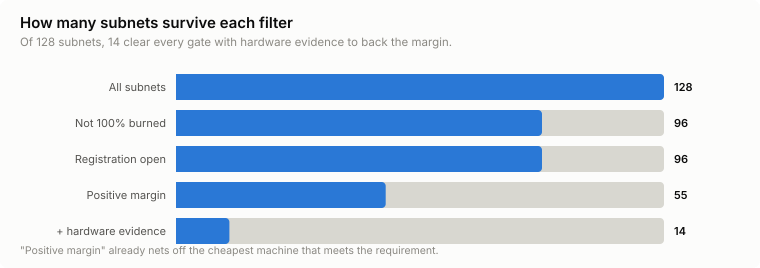
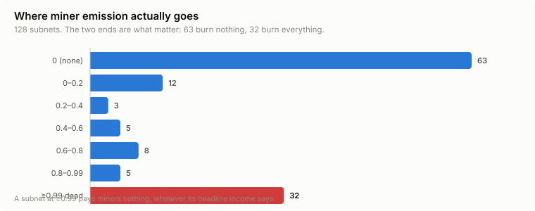
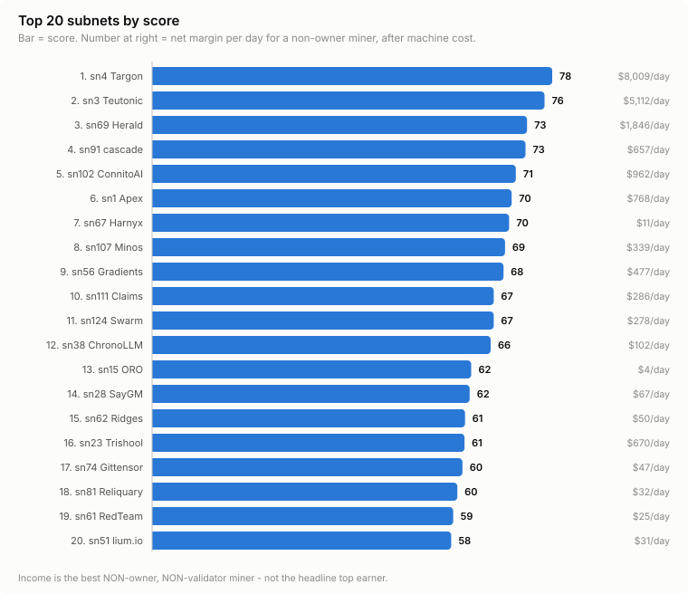

# Subnet watch — dashboard

_snapshot 2026-08-16T03:09:34Z · block 8854418 · run_status **ok**_

> Numbers here are quotable. Income is always `competitive_miner_usd_day` —
> the best miner that is neither the owner nor validator-permitted.

## The one number

# 49 of 128

subnets are worth looking at: not 100% burned, registration open, and the
competitive miner out-earns the cheapest machine that meets the requirement.

| | count | meaning |
|---|---:|---|
| Total subnets | 128 | everything on chain |
| Pays miners at all | 90 | `miner_burn` < 0.99 |
| Ranked | 90 | passed every gate |
| **Positive margin** | **49** | income beats machine cost |
| New events this window | 2 | see ALARMS.md |

## Where miner emission goes

The distribution is bimodal — subnets either burn nothing or burn everything.
There is very little middle ground, which is why burn is a gate and not a score.

| miner_burn | subnets | |
|---|---:|---|
| 0 (none) | 60 | `████████████████████████████` |
| 0–0.2 | 6 | `███` |
| 0.2–0.4 | 3 | `█` |
| 0.4–0.6 | 9 | `████` |
| 0.6–0.8 | 4 | `██` |
| 0.8–0.99 | 8 | `████` |
| ≥0.99 dead | 38 | `██████████████████` |

## Top 20

| # | subnet | score | net $/day (median) | ceiling $/day | machine | earners | top-1 share |
|---:|---|---:|---:|---:|---|---:|---:|
| 1 | sn107 Minos | 77.8 | 105 | 31,603 | cpu-small | 20 | 90% |
| 2 | sn76 Phylax | 76.7 | 67.71 | 380 | cpu-small | 10 | 28% |
| 3 | sn67 Harnyx | 72.5 | 23.42 | 428 | cpu-small | 115 | 17% |
| 4 | sn26 Perturb | 70.9 | 41.00 | 75.38 | rtx3060 | 10 | 70% |
| 5 | sn1 Apex | 70.3 | 814 | 1,117 | rtx4090* | 4 | 53% |
| 6 | sn41 Almanac | 69.9 | 12.82 | 53.90 | cpu-small | 74 | 65% |
| 7 | sn96 Verathos | 69.8 | 31.76 | 211 | rtx4090 | 58 | 41% |
| 8 | sn56 Gradients | 68.7 | 508 | 961 | rtx4090* | 7 | 67% |
| 9 | sn85 Vidaio | 68.6 | 491 | 496 | rtx4090* | 10 | 16% |
| 10 | sn62 Ridges | 68.5 | 475 | 2,201 | rtx4090* | 6 | 40% |
| 11 | sn91 cascade | 68.3 | 442 | 2,271 | rtx4090* | 5 | 51% |
| 12 | sn15 ORO | 68.3 | 11.45 | 12,454 | cpu-small | 86 | 93% |
| 13 | sn21 AdTAO | 67.7 | 7.67 | 34.37 | cpu-small | 88 | 45% |
| 14 | sn38 ChronoLLM | 66 | 97.21 | 1,329 | cpu-small | 10 | 52% |
| 15 | sn124 Swarm | 65.8 | 222 | 712 | rtx4090* | 24 | 11% |
| 16 | sn2 DSperse | 63 | 90.62 | 144 | rtx4090* | 5 | 82% |
| 17 | sn55 NIOME | 61.4 | 56.37 | 470 | rtx4090* | 11 | 29% |
| 18 | sn28 gm | 60 | 38.09 | 2,485 | rtx4090* | 38 | 28% |
| 19 | sn60 Bitsec.ai | 59.3 | 411 | 411 = | cpu-small | 3 | 50% |
| 20 | sn74 Gittensor | 58.6 | 26.17 | 209 | rtx4090* | 15 | 63% |

`=` after the ceiling means it equals the median exactly - either one competitive
miner exists, or they all earn the same. Both columns use identical precision;
if they ever disagree the data is wrong, since a median cannot exceed its own max.

`net $/day (median)` is what a newcomer should expect: the MEDIAN non-owner,
non-permitted miner, minus machine cost. `ceiling $/day` is the BEST competitive
miner - reachable only by beating everyone already there. Where the two diverge
wildly, the subnet is winner-take-all and the ceiling is not a plan.

`*` = machine is an assumed default; no hardware evidence was found for that subnet.

## Concentration — reported, never scored

A low top-1 share means many miners share the emission. A high one means a
single UID takes almost everything, so the headline income is not reachable.
**This is deliberately excluded from the score** — judge the shape yourself.

| top-1 share | subnets (of those that pay) |
|---|---:|
| wide (<30%) | 27 |
| concentrated (30–60%) | 18 |
| dominated (60–90%) | 17 |
| captured (>90%) | 26 |

## Hardware evidence quality

Most subnets do not state a requirement anywhere machine-readable, so their
margin assumes a default box. Treat those as indicative.

| basis | subnets |
|---|---:|
| no evidence | 102 |
| code-submission (validator runs it) | 10 |
| min_compute.yml (curated) | 9 |
| README keywords (GUESS) | 6 |
| README stated VRAM (explicit) | 1 |

## Recent changes (last 7 days)

| when | subnet | class | what |
|---|---|---|---|
| 2026-08-16T01:55 | sn71 | SCORING_COMMIT | sn71 commit touches scoring: Fix validator RPC boundary fixture |
| 2026-08-16T01:55 | sn111 | SCORING_COMMIT | sn111 commit touches scoring: Implement resilient batch scoring and wi |
| 2026-08-15T23:01 | sn76 | SCORING_COMMIT | sn76 commit touches scoring: Raise tasks per round across all four tra |
| 2026-08-15T20:35 | sn108 | SCORING_COMMIT | sn108 commit touches scoring: docs(miner): drop the second artefact th |
| 2026-08-15T17:59 | sn76 | SCORING_COMMIT | sn76 commit touches scoring: Add a local evaluation command |
| 2026-08-15T13:39 | sn100 | SCORING_COMMIT | sn100 commit touches scoring: fix(prism): rename lattice_score to sati |
| 2026-08-15T12:56 | sn100 | SCORING_COMMIT | sn100 commit touches scoring: feat(prism): live leaf from G2 benchmark |
| 2026-08-15T09:06 | sn67 | SCORING_COMMIT | sn67 commit touches scoring: chore(validator): bump repo-owned validat |
| 2026-08-15T09:06 | sn67 | README_TASK_DIFF | sn67 README task/scoring sections changed |
| 2026-08-15T04:45 | sn67 | SCORING_COMMIT | sn67 commit touches scoring: chore(validator): bump repo-owned validat |
| 2026-08-15T04:05 | sn71 | SCORING_COMMIT | sn71 commit touches scoring: Provision hotkey verification in gateway  |
| 2026-08-15T04:05 | sn108 | SCORING_COMMIT | sn108 commit touches scoring: feat(registry): require every evaluated  |
| 2026-08-15T03:25 | sn100 | SCORING_COMMIT | sn100 commit touches scoring: chore(deploy): promote prod prism-challe |
| 2026-08-15T01:47 | sn71 | SCORING_COMMIT | sn71 commit touches scoring: Keep private ICP scores out of telemetry |
| 2026-08-14T23:33 | sn2 | BURN_DROP | sn2 burn fell 1.000 -> 0.824 - miners can earn again |

---

_Regenerated every sweep. Charts are SVG and follow the same numbers._

