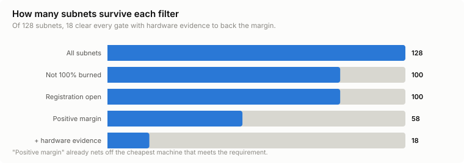
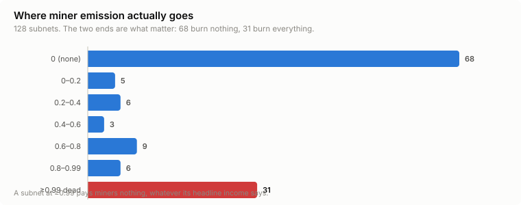
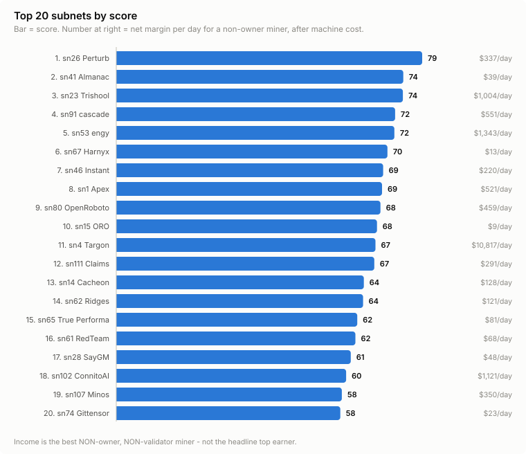

# Subnet watch — dashboard

_snapshot 2026-10-04T20:09:29Z · block 9211834 · run_status **ok**_

> Numbers here are quotable. Income is always `competitive_miner_usd_day` —
> the best miner that is neither the owner nor validator-permitted.

## The one number

# 61 of 128

subnets are worth looking at: not 100% burned, registration open, and the
competitive miner out-earns the cheapest machine that meets the requirement.

| | count | meaning |
|---|---:|---|
| Total subnets | 128 | everything on chain |
| Pays miners at all | 99 | `miner_burn` < 0.99 |
| Ranked | 99 | passed every gate |
| **Positive margin** | **61** | income beats machine cost |
| New events this window | 2 | see ALARMS.md |

## Where miner emission goes

The distribution is bimodal — subnets either burn nothing or burn everything.
There is very little middle ground, which is why burn is a gate and not a score.

| miner_burn | subnets | |
|---|---:|---|
| 0 (none) | 67 | `████████████████████████████` |
| 0–0.2 | 10 | `████` |
| 0.2–0.4 | 6 | `███` |
| 0.4–0.6 | 4 | `██` |
| 0.6–0.8 | 8 | `███` |
| 0.8–0.99 | 4 | `██` |
| ≥0.99 dead | 29 | `████████████` |

## Top 20

| # | subnet | score | net $/day (median) | ceiling $/day | machine | earners | top-1 share |
|---:|---|---:|---:|---:|---|---:|---:|
| 1 | sn23 Trishool | 74.3 | 1,020 | 1,020 = | cpu-small | 2 | 78% |
| 2 | sn41 Almanac | 73.6 | 33.11 | 1,905 | cpu-small | 127 | 29% |
| 3 | sn91 cascade | 73.1 | 715 | 2,289 | cpu-small | 5 | 52% |
| 4 | sn53 engy | 71.8 | 1,273 | 3,490 | rtx4090 | 14 | 22% |
| 5 | sn67 Harnyx | 70.6 | 14.04 | 939 | cpu-small | 128 | 30% |
| 6 | sn56 Gradients | 69.5 | 644 | 5,221 | rtx4090* | 8 | 39% |
| 7 | sn1 Apex | 69.2 | 583 | 1,072 | rtx4090* | 4 | 62% |
| 8 | sn46 Instant | 69.2 | 231 | 265 | cpu-small | 8 | 51% |
| 9 | sn111 Claims | 68.9 | 528 | 2,338 | rtx4090* | 5 | 61% |
| 10 | sn26 Perturb | 67.9 | 395 | 470 | rtx3060 | 3 | 60% |
| 11 | sn15 ORO | 67.1 | 9.16 | 17.90 | cpu-small | 52 | 98% |
| 12 | sn120 Affine | 67 | 377 | 570 | rtx4090* | 130 | 1% |
| 13 | sn4 Targon | 65.5 | 6,754 | 31,947 | rtx4090* | 5 | 70% |
| 14 | sn62 Ridges | 65 | 167 | 1,902 | rtx4090* | 31 | 21% |
| 15 | sn61 RedTeam | 62.7 | 82.43 | 147 | rtx4090* | 112 | 2% |
| 16 | sn28 SayGM | 61.2 | 55.03 | 2,791 | rtx4090* | 62 | 18% |
| 17 | sn14 Cacheon | 61.2 | 52.44 | 1,828 | rtx4090* | 13 | 23% |
| 18 | sn49 Nepher Robotics | 59.4 | 1,089 | 5,113 | rtx4090* | 4 | 69% |
| 19 | sn5 Hone | 58.8 | 38.68 | 41.09 | rtx4090* | 243 | 0% |
| 20 | sn107 Minos | 58.5 | 365 | 28,378 | cpu-small | 20 | 79% |

`=` after the ceiling means it equals the median exactly - either one competitive
miner exists, or they all earn the same. Both columns use identical precision;
if they ever disagree the data is wrong, since a median cannot exceed its own max.

`net $/day (median)` is what a newcomer should expect: the MEDIAN non-owner,
non-permitted miner, minus machine cost. `ceiling $/day` is the BEST competitive
miner - reachable only by beating everyone already there. Where the two diverge
wildly, the subnet is winner-take-all and the ceiling is not a plan.

`*` = machine is an assumed default; no hardware evidence was found for that subnet.

## Concentration — reported, never scored

A low top-1 share means many miners share the emission. A high one means a
single UID takes almost everything, so the headline income is not reachable.
**This is deliberately excluded from the score** — judge the shape yourself.

| top-1 share | subnets (of those that pay) |
|---|---:|
| wide (<30%) | 24 |
| concentrated (30–60%) | 24 |
| dominated (60–90%) | 22 |
| captured (>90%) | 24 |

## Hardware evidence quality

Most subnets do not state a requirement anywhere machine-readable, so their
margin assumes a default box. Treat those as indicative.

| basis | subnets |
|---|---:|
| no evidence | 96 |
| README keywords (GUESS) | 12 |
| min_compute.yml (curated) | 10 |
| code-submission (validator runs it) | 9 |
| README stated VRAM (explicit) | 1 |

## Recent changes (last 7 days)

| when | subnet | class | what |
|---|---|---|---|
| 2026-10-04T20:09 | sn25 | SCORING_COMMIT | sn25 commit touches scoring: Record final miner qualification and rema |
| 2026-10-04T20:09 | sn120 | SCORING_COMMIT | sn120 commit touches scoring: Authorize qualified verifier additions w |
| 2026-10-04T17:06 | sn9 | RELEASE | sn9 released v4.13.4 |
| 2026-10-04T17:06 | sn25 | SCORING_COMMIT | sn25 commit touches scoring: Verify completed original capture and Yum |
| 2026-10-04T17:06 | sn25 | README_TASK_DIFF | sn25 README task/scoring sections changed |
| 2026-10-04T17:06 | sn116 | BURN_DROP | sn116 burn fell 1.000 -> 0.000 - miners can earn again |
| 2026-10-04T17:06 | sn120 | SCORING_COMMIT | sn120 commit touches scoring: Update public miner setup for signed for |
| 2026-10-04T12:45 | sn25 | SCORING_COMMIT | sn25 commit touches scoring: Retain passing signed-history and termina |
| 2026-10-04T12:45 | sn28 | RELEASE | sn28 released v0.4.25 |
| 2026-10-04T12:45 | sn28 | SCORING_COMMIT | sn28 commit touches scoring: Handle scheduled miner price increases as |
| 2026-10-04T12:45 | sn51 | SCORING_COMMIT | sn51 commit touches scoring: validator: keep a banned node verified wh |
| 2026-10-04T12:45 | sn71 | SCORING_COMMIT | sn71 commit touches scoring: Bind local verifier fix to protected work |
| 2026-10-04T12:45 | sn78 | SCORING_COMMIT | sn78 commit touches scoring: Stabilize checkpoint cache verification |
| 2026-10-04T12:45 | sn81 | SCORING_COMMIT | sn81 commit touches scoring: docs(corpus): episode jobs on the split v |
| 2026-10-04T12:45 | sn120 | SCORING_COMMIT | sn120 commit touches scoring: Document guarded covered-training handof |

---

_Regenerated every sweep. Charts are SVG and follow the same numbers._

