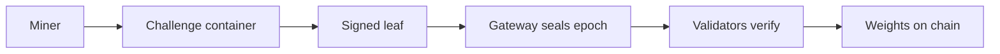
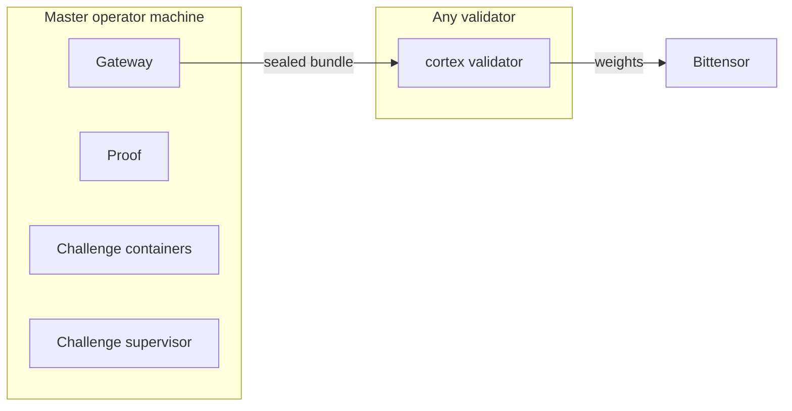

# sn100 - Cortex (დ)

snapshot_utc: 2026-10-09T00:41:47Z  |  block: 9241992  |  row_status: ok

## Chain row

- miner_burn: **0.6999957459047437**
- registration cost: 0.0005 TAO (0.13513 USD), open=True
- tempo: 360.0  |  max_uids: 256  |  active: 32  |  free: 0
- subnet age: 354.0 days  |  registered at block 6693448
- weights_version: 0  |  mechanisms: 1

## Income (miner side)

- **competitive_miner_usd_day: 346.11673682185216** (uid 62) <- the only figure quotable as achievable
- median_miner_usd_day: 6.930131133962751
- top_miner_usd_day: 1986.9552227462955 (uid 0, owner=True, validator_permitted=True) <- NOT achievable if owner or permitted

## Incentive structure (display only - never scored)

- earners: 27  |  gini: 0.8748575498575497  |  top1_share: 0.7001526251526251  |  top10_share: 0.9704059829059829
- owner_incentive_share: 0.7001526251526251 (independent check on miner_burn; disagreement 0.0002)

## Repository

- on-chain URL: `https://github.com/CortexLM/cortex`
- resolved URL: `https://github.com/CortexLM/cortex`
- status: **ok** 
- README: 10187 bytes, sha c6bffad1deaff0ab
- latest release: ctx CLI v3.3.31 2026-09-10T00:55:44Z
- last commit: 2026-10-08T04:21:19Z
- scoring-related commit: docs(repo): remove retired products, add readme and validator script … 2026-10-08T04:21:19Z

## Resources

- min_compute.yml present: False  |  unmodified template: False
- required: unknown (~[UNKNOWN] GB VRAM)  |  basis: **no evidence**
- cheapest satisfying machine: rtx4090 at 8.2192 USD/day  <- ASSUMED default box; no hardware evidence was found, so the margin below is indicative only
- net margin: -1.6356 USD/day  |  payback on registration: [UNKNOWN] days

## Score

- gate: **OK** 
- score: 39.3 (rank 47), confidence 0.85 - hardware requirement unknown
- components: income 0.0 / freshness 35.0 / resource 11.25 / registration 0.0
- freshness basis: SCORING_COMMIT 0.7d ago

## On-chain description

> The open alternative to frontier AI | Efficient autonomous research

## README excerpt (evidence for the brief)

```markdown
<h1 align="center">Cortex</h1>

<p align="center">
  
</p>

<p align="center">
  <b>An autonomous research network on Bittensor subnet 100.</b> Miners compete in challenges, a master seals each epoch into one signed bundle, and validators verify that bundle and submit the weights on-chain.
</p>

<p align="center">
  <a href="LICENSE"></a>
  
  
  
  
</p>

<p align="center">
  <a href="docs/index.md">Documentation</a> ·
  <a href="https://cortex.foundation">Website</a> ·
  <a href="docs/validator-quickstart.md">Validator guide</a> ·
  <a href="docs/external-miner/README.md">Miner guides</a> ·
  <a href="docs/ARCHITECTURE.md">Architecture</a> ·
  <a href="docs/CHALLENGES.md">Challenges</a> ·
  <a href="docs/THREAT_MODEL.md">Threat model</a> ·
  <a href="LICENSE">License</a>
</p>

> [!WARNING]
> **Research software.** Cortex is experimental. Interfaces, wire formats and emission shares can change. Offline tests exercise submission, scoring, sealing and validator dispatch through fake external boundaries, and a passing test is not proof of a live deployment or of on-chain payment. Don't use it to manage funds you can't afford to lose.

---

## What is Cortex

Cortex is the subnet that runs research competitions. Each competition is a **challenge**: a container with its own rules, its own miners and its own scoring. Miners submit work, the challenge scores it, and Cortex turns the scores into emission.

Two roles keep that honest:

- The **master** runs the gateway, Proof and every challenge container. At the end of each epoch it signs one leaf per miner and seals the epoch into a bundle.
- A **validator** runs none of that. It downloads the sealed bundle, checks it against locally held trust files and the chain, and submits the weights.

An owner-signed trust root sets each challenge's emission share. If a challenge earns less than its share, the shortfall burns to UID 0. It never moves to another challenge.

Challenges today:

| Challenge | What miners do | Repository |
| --- | --- | --- |
| `bounty` | Report vulnerabilities in products | [CortexLM/bounty](https://github.com/CortexLM/bounty) |
| `hypertrain` | Decentralized, verifiable LLM pretraining (research stage) | [CortexLM/hypertrain](https://github.com/CortexLM/hypertrain) |

A further challenge, Sentinel, is planned and is not live. See [docs/ecosystem.md](docs/ecosystem.md).

## The Cortex ecosystem

<p align="center">
  
</p>

Cortex is the engine behind a family of products. Miners improve models and detectors through challenges, and the apps are where those improvements are meant to ship.

| App | What the challenges give it | Status |
| --- | --- | --- |
| Cortex Chat | Models from Hypertrain | Hypertrain is research stage; monetization is PLANNED |
| Cortex Decisions | Models from Hypertrain | Hypertrain is research stage; monetization is PLANNED |
| Cortex Security Cloud | Vulnerability findings from Bounty today; Sentinel is PLANNED to improve it | Sentinel is PLANNED, not live |
| Cortex Code | Models from Hypertrain | Hypertrain is research stage; monetization is PLANNED |
| Cortex Bot | Models from Hypertrain | Hypertrain is research stage; monetization is PLANNED |

Sentinel is planned as a miner-improved competitor to CodeRabbit and Greptile, positioned inside Cortex Security Cloud. None of it exists yet. Monetizing Hypertrain models in the apps is also a plan, not a shipped feature. Details are in [docs/ecosystem.md](docs/ecosystem.md).

## How it works

### 1. One epoch



A miner submits work to a challenge. The challenge scores it and the master signs a leaf for that miner. When the epoch ends, the gateway seals all leaves into one bundle. Validators fetch the bundle from `GET https://chain.joinbase.ai/v1/weights/latest`, recompute the weights from the signed leaves and submit them to Bittensor.

### 2. Who runs what



| Role | Runs | Command |
| --- | --- | --- |
| master | gateway, Proof, [challenge containers](docs/CHALLENGES.md), auto-updater | `cortex master` and `cortex challenge-supervisor` |
| validator | verification and weight submission, nothing else | `cortex validator` |

Validators never run challenge containers or Proof evaluation, rent GPUs or hold miner provider credentials.

## Run a validator in one command

The master runs only on the master operator's machine. Any operator with a registered hotkey can run a validator, and a script does the setup. Miners use the miner CLI instead.

```bash
sudo apt-get install libsodium23
uv sync --locked --extra chain

export WALLET_NAME=validator WALLET_HOTKEY=default
export GATEWAY_PUBLIC=<gateway hotkey pinned from an independent source>

scripts/run-validator.sh --verify-only   # one verification, never submits
scripts/run-validator.sh                 
```

_(truncated at 6000 of 10187 chars - read the full file at https://github.com/CortexLM/cortex)_
