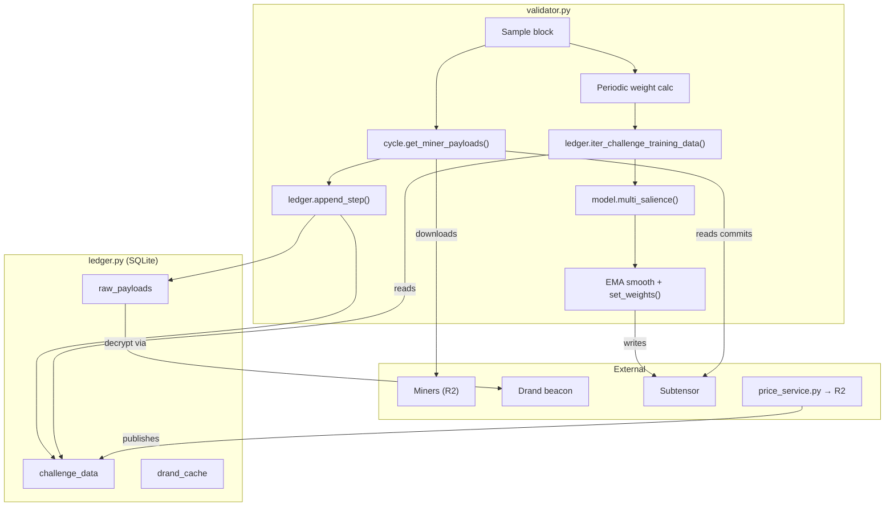

# sn123 - MANTIS (𑀀)

snapshot_utc: 2026-08-23T21:01:55Z  |  block: 8910178  |  row_status: ok

## Chain row

- miner_burn: **0.3501584988553077**
- registration cost: 0.15 TAO (36.594 USD), open=True
- tempo: 360.0  |  max_uids: 256  |  active: 255  |  free: 0
- subnet age: 432.8 days  |  registered at block 5794330
- weights_version: 0  |  mechanisms: 1

## Income (miner side)

- **competitive_miner_usd_day: 123.32747341901504** (uid 253) <- the only figure quotable as achievable
- median_miner_usd_day: 2.757769978063843
- top_miner_usd_day: 632.8254768663099 (uid 0, owner=True, validator_permitted=True) <- NOT achievable if owner or permitted

## Incentive structure (display only - never scored)

- earners: 249  |  gini: 0.7273413747949631  |  top1_share: 0.3508393725346298  |  top10_share: 0.5476408892150567
- owner_incentive_share: 0.3508393725346298 (independent check on miner_burn; disagreement 0.0007)

## Repository

- on-chain URL: `https://github.com/Barbariandev/MANTIS`
- resolved URL: `https://github.com/Barbariandev/MANTIS`
- status: **ok** 
- README: 16267 bytes, sha 891528790510e50f
- latest release: (none) 
- last commit: 2026-08-17T17:37:37Z
- scoring-related commit: Update validator.py 2026-07-17T19:12:26Z

## Resources

- min_compute.yml present: True  |  unmodified template: False
- required: unknown (~[UNKNOWN] GB VRAM)  |  basis: **no evidence**
- cheapest satisfying machine: rtx4090 at 8.2192 USD/day  <- ASSUMED default box; no hardware evidence was found, so the margin below is indicative only
- net margin: -5.5717 USD/day  |  payback on registration: [UNKNOWN] days

## Score

- gate: **OK** 
- score: 39.3 (rank 42), confidence 0.85 - hardware requirement unknown
- components: income 0.0 / freshness 35.0 / resource 11.25 / registration 0.0
- freshness basis: README_TASK_DIFF 6.1d ago

## On-chain description

> Incentivizing cooperative prediction

## README excerpt (evidence for the brief)

```markdown
# MANTIS

Bittensor Subnet 123, The Ultimate Signal Machine

---

## Architecture

Validators sample miner payloads every `SAMPLE_EVERY` blocks, decrypt them after a timelock maturation window, and store (embedding, price) pairs in a SQLite database. Periodically, walk-forward scoring computes per-hotkey salience for each challenge, aggregates across challenges by weight, applies EMA smoothing, and sets on-chain weights.



---

## Challenges

All challenges are defined in `config.py` under `CHALLENGES`. Each specifies a `ticker`, `dim`, `blocks_ahead` (forward horizon in blocks at 12s/block), `loss_func` (scoring dispatch key), and `weight` (relative importance in final aggregation).

| Challenge | Ticker | dim | Horizon | loss_func | Weight | Description |
|---|---|---|---|---|---|---|
| ETH-1H-BINARY | `ETH` | 2 | 300 (1h) | `binary` | 1.0 | Binary direction prediction |
| CADUSD-1H-BINARY | `CADUSD` | 2 | 300 | `binary` | 0.5 | " |
| NZDUSD-1H-BINARY | `NZDUSD` | 2 | 300 | `binary` | 0.5 | " |
| CHFUSD-1H-BINARY | `CHFUSD` | 2 | 300 | `binary` | 1.0 | " |
| XAGUSD-1H-BINARY | `XAGUSD` | 2 | 300 | `binary` | 1.0 | " |
| ETH-HITFIRST | `ETHHITFIRST` | 3 | 500 | `hitfirst` | 1.25 | Barrier-hit direction |
| ETH-LBFGS | `ETHLBFGS` | 17 | 300 (1h) | `lbfgs` | 3.5 | Volatility regime + quantile paths |
| BTC-LBFGS-6H | `BTCLBFGS` | 17 | 1800 (6h) | `lbfgs` | 2.875 | " |
| MULTI-BREAKOUT | `MULTIBREAKOUT` | 2/asset | event | `range_breakout_multi` | 5.0 | Range breakout continuation/reversal (33 assets) |
| XSEC-RANK | `MULTIXSEC` | 1/asset | 1200 (4h) | `xsec_rank` | 3.0 | Cross-sectional return ranking (33 assets) |
| FUNDING-XSEC | `FUNDINGXSEC` | 1/asset | 2400 (8h) | `funding_xsec` | 4.0 | Cross-sectional funding rate ranking (20 assets) |
| FLOW-BTC | `FLOW` | 28 | horizon-driven, 1–336h | `flow` | 0.0 (7.875 = 25% at emission turn-on, 2026-09-14) | Capital-at-risk BTC bracket trades, evidence-gated payment |

TRADE-MIX is deprecated as of the FLOW launch (2026-08-17): off the
active roster, historical challenge data purged from validator
datalogs on open.

---

## Scoring

### Per-challenge scoring

Each `loss_func` has its own scoring path. All use L2 logistic regression and coefficient-based importance, but the structure differs.

**Binary** (`binary`) — Walk-forward with ElasticNet meta-model. Feature selection: per-miner L2 logistic on first half, AUC on second half, select top-$K$ (default 50). Meta-model: ElasticNet logistic (L1 ratio 0.5) on OOS base-model predictions across walk-forward segments. Importance = $|\beta_j|$. Segments weighted by recency.

**LBFGS** (`lbfgs`) — Two independent scoring paths blended 75/25:
- *Classifier path* (`compute_linear_salience`): per-class L2 logistic regressions on 5-bucket argmax predictions. Importance = $\beta_j^2$ summed across classes. Vectorized balanced accuracy evaluation. Uniqueness penalty suppresses miners with >85% argmax overlap with higher-ranked peers.
- *Q-path* (`compute_q_path_salience`): 12 independent binary L2 logistic models (one per tail-bucket / sigma-threshold combination). Importance = averaged $|\beta_j|$ across sub-models.

Both paths are individually top-$K$ renormalized with exponential rank decay before blending.

**HITFIRST** (`hitfirst`) — Two L2 logistic regressions on logit-transformed miner probabilities: one for up-barrier-hit ($y=1$ if price hits $+\sigma$ first), one for down-barrier-hit. Importance = $|\beta_j^{\text{up}}| + |\beta_j^{\text{down}}|$. No walk-forward — single fit on all valid samples.

**MULTI-BREAKOUT** (`range_breakout_multi`) — Operates on completed breakout events (not time series). Two-stage: (1) Empirical AUC gate — per-miner AUC on $P_{\text{continuation}}$ vs realized label, requiring AUC > 0.5 and ≥ 2 temporal episodes. (2) L2 logistic on z-scored miner predictions with episode-balanced sample weighting (each temporal episode gets equal total weight regardless of event count). Importance = $|\beta_j|$.

**XSEC-RANK** (`xsec_rank`) — Cross-sectional binary reformulation: label = 1 if asset's forward return exceeds the cross-sectional median. All assets pooled ($N_{\text{assets}} \times$ sample multiplier). Walk-forward meta-model: feature selection by per-miner univariate AUC, top-$K$ (default 20) selected, L2 logistic meta-model. Importance per segment:

$$
w_j = |\beta_j| \cdot \max\!\Big(\frac{\text{AUC}_{\text{meta}} - 0.5}{0.5},\; 0\Big)
$$

Segments aggregated with exponential recency weighting.

**FUNDING-XSEC** (`funding_xsec`) — Same structure as XSEC-RANK but on funding rate changes instead of price returns. Embargo = $\max(\text{LAG}, \text{ahead})$ with explicit `train_cutoff = val_start - ahead` to prevent label leakage from forward-looking labels. Stale miners (temporal std < $10^{-4}$ per asset column) zeroed before pooling.

**FLOW** (`flow`) — Not a regression challenge: miners submit bracket trades (direction, Kelly fraction, stop, two targets, horizon) across four horizon regimes, resolved against multi-venue klines. Per-trade R is path-penalized, tail-amplified, and Kelly-weighted into a per-regime EWMA, and payment is gated behind a significance statistic, t
```

_(truncated at 6000 of 16267 chars - read the full file at https://github.com/Barbariandev/MANTIS)_
