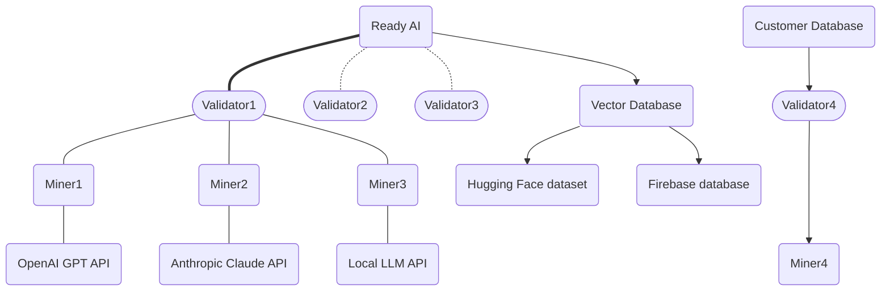

# sn33 - ReadyAI (ט)

snapshot_utc: 2026-08-30T07:31:41Z  |  block: 8956525  |  row_status: ok

## Chain row

- miner_burn: **0.0**
- registration cost: 0.050293344 TAO (11.92756946304 USD), open=True
- tempo: 360.0  |  max_uids: 256  |  active: 255  |  free: 0
- subnet age: 835.1 days  |  registered at block 2943950
- weights_version: 2388  |  mechanisms: 1

## Income (miner side)

- **competitive_miner_usd_day: 19.93245306635565** (uid 179) <- the only figure quotable as achievable
- median_miner_usd_day: 14.214986265743109
- top_miner_usd_day: 19.93245306635565 (uid 179, owner=False, validator_permitted=False) <- NOT achievable if owner or permitted

## Incentive structure (display only - never scored)

- earners: 247  |  gini: 0.10225096708791015  |  top1_share: 0.005809242811062021  |  top10_share: 0.056502530078119034
- owner_incentive_share: 0.0 (independent check on miner_burn; disagreement 0.0)

## Repository

- on-chain URL: `https://github.com/afterpartyai/bittensor-conversation-genome-project`
- resolved URL: `https://github.com/afterpartyai/bittensor-conversation-genome-project`
- status: **ok** 
- README: 47541 bytes, sha bb85dbd7b14d5908
- latest release: v1.91.12: Merge pull request #26 from afterpartyai/cgp_release/2024.07.26_1203 2024-07-26T18:36:39Z
- last commit: 2026-08-20T17:21:26Z
- scoring-related commit: Merge pull request #136 from afterpartyai/Fix-Validator-timeout 2026-08-20T17:21:26Z

## Resources

- min_compute.yml present: True  |  unmodified template: True
- required: unknown (~[UNKNOWN] GB VRAM)  |  basis: **no evidence**
- cheapest satisfying machine: rtx4090 at 8.2192 USD/day  <- ASSUMED default box; no hardware evidence was found, so the margin below is indicative only
- net margin: 5.9958 USD/day  |  payback on registration: 1.99 days

## Score

- gate: **OK** 
- score: 41.9 (rank 47), confidence 0.85 - hardware requirement unknown
- components: income 7.68 / freshness 21.0 / resource 11.25 / registration 9.34
- freshness basis: SCORING_COMMIT 10d ago

## On-chain description

> (none)

## README excerpt (evidence for the brief)

```markdown

# **ReadyAI** <!-- omit in toc -->
[](https://discord.gg/bittensor)
[](https://opensource.org/licenses/MIT)

---
- [Conversation Genome Project](#conversation-genome-project-overview)
  - [Key Features](#key-features)
  - [Benefits](#Benefits)
  - [System Design](#System-Design)
  - [Task Types](#task-types)
  - [Rewards and Incentives](#reward-mechanism)
- [Getting Started](#Getting-Started)
  - [Installation & Compute Requirements](#installation--compute-requirements)
  - [Configuration](#configuration)
  - [LLM Selection](#LLM-Selection)
  - [Quickstart - Running the tests](#running-the-tests)
  - [Registration](#Registration)
  - [Get Running Quickly with the Docker Image!](#Running-a-Miner-or-a-Validator-with-Docker)
  - [Get a miner Running on Runpod](#Running-a-Miner-on-Runpod)
- [Subnet Roles](#subnet-roles)
  - [Mining](#mining)
  - [Validating](#validating)
- [Helpful Guides](#helpful-guides)
  - [Runpod](#Runpod)
  - [Managing Processes](#managing-processes)
  - [Making sure your port is open](#making-sure-your-port-is-open)
- [llms.txt Reference MCP](#llmstxt-reference-mcp)
- [License](#license)

---

# Introduction to ReadyAI

ReadyAI is an open-source initiative aimed at provide a low-cost resource-minimal data structuring and semantic tagging pipeline for any individual or business. AI runs on Structured Data. ReadyAI is a low-cost, structured data pipeline to turn your raw data into structured data for your vector databases and AI applications.

If you are new to Bittensor, please checkout the [Bittensor Website](https://bittensor.com/) before proceeding to the setup section.



## Key Features

- Raw Data in, structured AI Ready Data out
- Fractal data mining allows miners to process a wide variety of data sources and create tagged, structured data for the end user’s specific needs
- Validators establish a ground truth by tagging the data in full, create data windows for fractal mining, and score miner submissions
- Scoring is based on a cosine distance calculation between the miner’s window tagged output and the validator’s ground truth tagged output
- ReadyAI has created a low-cost structured data pipeline capitalizing on two key innovations: (1) LLMs are now more accurate and cheaper than human annotators and (2) Distributed compute vs. distributed workers make this infinitely scalable
- Incentivized mining and validation system for data contribution and integrity


# Getting Started

## Installation & Compute Requirements

This repository requires Python version greater than 3.8 and up to 3.11. To get started, clone the repository and install the required dependencies:

```console
git clone https://github.com/afterpartyai/bittensor-conversation-genome-project.git cgp-subnet
cd cgp-subnet
pip install -r requirements.txt
```

Miners & Validators using an OpenAI API Key will need a CPU with at least 8GB of Ram and 20GB of Disk Space.


## Quickstart Mock Tests

The best way to begin to understand ReadyAI’s data pipeline is to run the unit tests. These tests are meant to provide verbose output so you can see how the process works.

### Configuration

Let's configure your instance and run the tests that verify everything is setup properly.

You'll need to duplicate the dotenv file to setup your own configuration:

```console
cp env.example .env
```

Use your editor to open the .env file, and follow instructions to enter the required API Keys and configurations. **An OpenAI API key is required by both miners and validators***. GPT-4o is the default LLM used for all operations, as it is the cheapest and most performant model accessible via API. Please see [LLM Selection](#LLM-Selection) Below for more information.

**A Weights and Biases Key is required by both miners and validators** as well.

**Please follow all instructions in the .env**

If you're on a Linux box, the nano editor is usually the easiest:

```console
nano .env
```

### LLM Selection

**Please follow all instructions in the .env**

LLM utilization is required in this subnet to annotate raw data. As a miner or validator, GPT-4o is the default LLM used for all operations. If you wish to override this default selection, you can follow override instructions below or in your `.env` file. After completing the steps in [Configuration](#Configuration), you can open up your `.env` file, and view the options. Currently, we offer out-of-the-box configuration for OpenAI, Anthropic, and groq APIs. 

To change the default OpenAI Model used by your miner or validator, you first must uncomment `LLM_TYPE_OVERRIDE=openai` and the select your model using the `OPENAI_MODEL` parameter in the .env:

```
# ____________ OpenAI Configuration: ________________
# OpenAI is the default LLM provider for all miner and validator operations, utilizing GPT-4o.
# To override your OpenAI model choice, uncomment the line below, then proceed to selecting a model. For other override options, see "Select LLM Override" below.
#export LLM_TYPE_OVERRIDE=openai

Enter a model below. See all options at: https://platform.openai.com/docs/models
#export OPENAI_MODEL=gpt-3.5-turbo
#export OPENAI_MODEL=gpt-4-turbo
```

If you wish to use a provider other than OpenAI, you select your LLM Override by uncommenting a line in this section of the .
```

_(truncated at 6000 of 47541 chars - read the full file at https://github.com/afterpartyai/bittensor-conversation-genome-project)_
