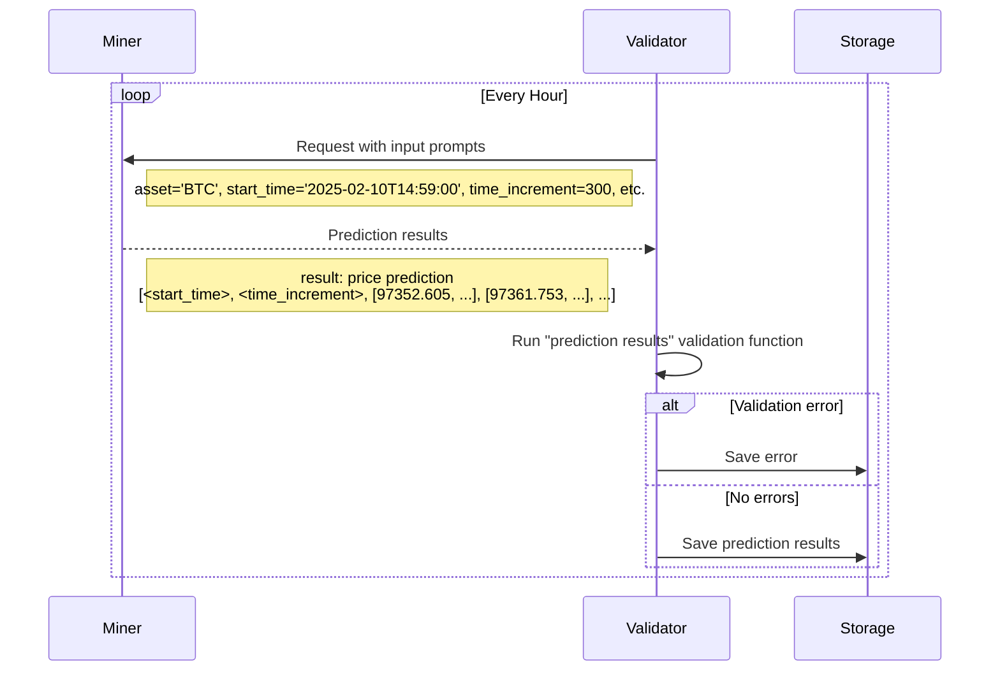

# sn50 - Synth (ש)

snapshot_utc: 2026-08-08T11:15:56Z  |  block: 8799258  |  row_status: ok

## Chain row

- miner_burn: **5.329493433237076e-07**
- registration cost: 0.8 TAO (157.12 USD), open=True
- tempo: 360.0  |  max_uids: 256  |  active: 249  |  free: 0
- subnet age: 560.6 days  |  registered at block 4763204
- weights_version: 100  |  mechanisms: 1

## Income (miner side)

- **competitive_miner_usd_day: 31.26580905186725** (uid 6) <- the only figure quotable as achievable
- median_miner_usd_day: 9.934528048117379
- top_miner_usd_day: 31.26580905186725 (uid 6, owner=False, validator_permitted=False) <- NOT achievable if owner or permitted

## Incentive structure (display only - never scored)

- earners: 240  |  gini: 0.3563427178726679  |  top1_share: 0.011114678408170129  |  top10_share: 0.09660750049687351
- owner_incentive_share: 0.0 (independent check on miner_burn; disagreement 0.0)

## Repository

- on-chain URL: `https://github.com/mode-network/synth-subnet`
- resolved URL: `https://github.com/synthdataco/synth-subnet`
- status: **redirected** - https://github.com/mode-network/synth-subnet -> https://github.com/synthdataco/synth-subnet
- README: 21267 bytes, sha d0e181e1f7706fa7
- latest release: v1.11.1 2026-08-03T14:43:07Z
- last commit: 2026-07-30T15:22:19Z
- scoring-related commit: Validator: optional Pub/Sub notification for stored prediction cohort… 2026-07-17T13:05:32Z

## Resources

- min_compute.yml present: True  |  unmodified template: True
- required: unknown (~[UNKNOWN] GB VRAM)  |  basis: **no evidence**
- cheapest satisfying machine: rtx4090 at 8.2192 USD/day  <- ASSUMED default box; no hardware evidence was found, so the margin below is indicative only
- net margin: 1.7153 USD/day  |  payback on registration: 91.6 days

## Score

- gate: **OK** 
- score: 42.7 (rank 35), confidence 0.85 - hardware requirement unknown
- components: income 3.95 / freshness 35.0 / resource 11.25 / registration 0.0
- freshness basis: RELEASE 4.8d ago

## On-chain description

> Predictive intelligence for financial markets and beyond

## README excerpt (evidence for the brief)

```markdown
<div align="center">
  <a href="https://www.synthdata.co/">
    
  </a>
</div>

<h1 align="center">
    Synth Subnet
</h1>

<div align="center">
    <a href="https://www.synthdata.co" target="_blank">
        <b>Website</b>
    </a>
·
    <a href="https://github.com/synthdataco/synth-subnet/blob/main/Synth%20Whitepaper%20v1.pdf" target="_blank">
        <b>Whitepaper</b>
    </a>
·
    <a href="https://discord.gg/gnt8sFMdg6" target="_blank">
        <b>Discord</b>
    </a>
·
    <a href="https://api.synthdata.co/docs" target="_blank">
        <b>API Documentation</b>
    </a>
</div>

---

<div align="center">

[][license]

</div>

---

### Table of contents

- [1. Overview](#-1-overview)
  - [1.1. Introduction](#11-introduction)
  - [1.2. Task Presented to the Miners](#12-task-presented-to-the-miners)
  - [1.3. Validator's Scoring Methodology](#13-validators-scoring-methodology)
  - [1.4. Calculation of Leaderboard Score](#14-calculation-of-leaderboard-score)
- [2. Usage](#-2-usage)
  - [Quick Start](#quick-start)
  - [2.1. Miners](#21-miners)
    - [2.1.1. Tutorial](#211-tutorial)
    - [2.1.2. Reference](#212-reference)
    - [2.1.3. Automated Deployment](#213-automated-deployment)
    - [2.1.4. Backtesting](#214-backtesting)
  - [2.2. Validators](#22-validators)
  - [2.3. Develop](#23-develop)
- [3. License](#-3-license)

## 🔭 1. Overview

> **TL;DR** — Miners submit ensembles of simulated price paths for a basket of crypto, equity, and commodity assets across two timeframes (`24h` and `1h`). Validators score each ensemble with CRPS on price changes over multiple time increments, take a rolling weighted average within a per-timeframe window (10 days for `24h`, 5 days for `1h`), and allocate emissions via softmax — equally split between 3 competitions: Crypto 1h, Crypto 24h, Commodities/Equities 24h. Lower CRPS → more emissions.

### 1.1. Introduction

The Synth Subnet leverages Bittensor’s decentralized intelligence network to create the world's most powerful synthetic data for price forecasting. Unlike traditional price prediction systems that focus on single-point forecasts, Synth specializes in capturing the full distribution of possible price movements and their associated probabilities, to build the most accurate synthetic data in the world.

Miners in the network are tasked with generating multiple simulated price paths, which must accurately reflect real-world price dynamics including volatility clustering and fat-tailed distributions. Their predictions are evaluated using the Continuous Ranked Probability Score (CRPS), which measures both the calibration and sharpness of their forecasts against actual price movements.

Validators score miners on short-term and long-term prediction accuracy, averaging each miner's per-request scores over a short rolling window so that recent performance dominates. Daily emissions are allocated based on miners’ relative performance, creating a competitive environment that rewards consistent accuracy.

<div align="center">
    
</div>

Figure 1.1: Overview of the synth subnet.

The Synth Subnet aims to become a key source of synthetic price data for AI Agents and the go-to resource for options trading and portfolio management, offering valuable insights into price probability distributions.

<sup>[Back to top ^][table-of-contents]</sup>

### 1.2. Task Presented to the Miners



Miners are tasked with providing probabilistic forecasts of an asset's future price movements. Specifically, each miner is required to generate multiple simulated price paths for an asset, from the current time over specified time increments and time horizon. The network currently runs two competitions distinguished by their forecast timeframe — `24h` and `1h` HFT — and the supported assets on each are listed in the parameter sections below.

The asset set has grown over time:

| Date       | Change                                                                                                                                                                                                                |
| ---------- | --------------------------------------------------------------------------------------------------------------------------------------------------------------------------------------------------------------------- |
| Launch     | BTC only on the `24h` competition. 100 simulated paths, 5-minute increments.                                                                                                                                          |
| 2025-11-13 | Bumped to 1000 paths; added ETH, SOL, XAU to the `24h` competition. Synth begins moving toward HFT.                                                                                                                   |
| 2026-01    | Added tokenized equities SPYX, NVDAX, TSLAX, AAPLX, GOOGLX to the `24h` competition.                                                                                
```

_(truncated at 6000 of 21267 chars - read the full file at https://github.com/synthdataco/synth-subnet)_
