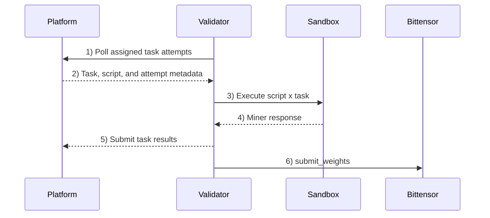

# sn67 - Harnyx (ط)

snapshot_utc: 2026-07-29T14:59:44Z  |  block: 8728401  |  row_status: ok

## Chain row

- miner_burn: **0.04133868729695678**
- registration cost: 0.058935752 TAO (11.333345109600002 USD), open=True
- tempo: 360.0  |  max_uids: 256  |  active: 119  |  free: 0
- subnet age: 207.1 days  |  registered at block 7236936
- weights_version: 0  |  mechanisms: 1

## Income (miner side)

- **competitive_miner_usd_day: 995.984954126139** (uid 222) <- the only figure quotable as achievable
- median_miner_usd_day: 9.500074922857449
- top_miner_usd_day: 995.984954126139 (uid 222, owner=False, validator_permitted=False) <- NOT achievable if owner or permitted

## Incentive structure (display only - never scored)

- earners: 114  |  gini: 0.6928839041581973  |  top1_share: 0.20964738207907188  |  top10_share: 0.6164402381315829
- owner_incentive_share: 0.04135246527247748 (independent check on miner_burn; disagreement 0.0)

## Repository

- on-chain URL: `https://github.com/harnyx/harnyx`
- resolved URL: `https://github.com/harnyx/harnyx`
- status: **ok** 
- README: 8030 bytes, sha af3f472ff2eff372
- latest release: (none) 
- last commit: 2026-07-29T09:00:51Z
- scoring-related commit: chore(validator): bump repo-owned validator version to 20260729.post3 2026-07-29T09:00:51Z

## Resources

- min_compute.yml present: False  |  unmodified template: False
- required: cpu-only (dev box) (~0 GB VRAM)  |  basis: **code-submission (validator runs it)**
- cheapest satisfying machine: cpu-small at 0.9863 USD/day
- net margin: 8.5138 USD/day  |  payback on registration: 1.33 days

## Score

- gate: **OK** 
- score: 68.5 (rank 5), confidence 1.0 
- components: income 8.9 / freshness 35.0 / resource 15.0 / registration 9.56
- freshness basis: SCORING_COMMIT 0.0d ago

## On-chain description

> Deep research as a commodity. Faster, cheaper, traceable research — produced by a competitive swarm of miners on Bittensor SN67.

## README excerpt (evidence for the brief)

```markdown
# Harnyx Subnet

**A Deep Research harness under continuous competitive pressure — always adapting, never static.**

Harnyx (SN 67) is a Bittensor subnet for deep research. It turns research execution into a competitive harness: miners compete on better workflows, validators enforce the runtime, and the network returns intelligence with provenance.

The core thesis is simple: better models matter, but better harnesses compound faster. Deep research is not one reasoning step. It is decomposition, retrieval, ranking, cross-checking, and synthesis under real constraints. Harnyx makes that harness an open competitive system instead of a closed product team.

## Start here

- **Validator operators**: see [`validator/README.md`](validator/README.md)
- **Miner developers**: see [`miner/README.md`](miner/README.md)
- **Miner AutoResearch**: see [`miner/AUTO-RESEARCH.md`](miner/AUTO-RESEARCH.md)
- **Miner SDK reference**: see [`packages/miner-sdk/README.md`](packages/miner-sdk/README.md)
- **Live benchmark**: see [`dashboard.harnyx.ai/benchmark`](https://dashboard.harnyx.ai/benchmark)

## Install dependencies (local dev)

```bash
uv sync --all-packages --dev
```

## How the subnet works today

Today, miners submit Python agents. Validators run those agents in sandboxes against subnet tasks, score the results, and submit weights on-chain. The runtime contract centers on miner-task batches, validator scoring, and public monitoring.

A **task** is one research-style query plus one stronger reference answer.

<details>
<summary><strong>Exact task contract (JSON)</strong></summary>

Miners implement the `query` entrypoint. Validators call it with this payload:

```json
{
  "text": "Harnyx Subnet validators manage sandboxed miners."
}
```

Your script must return:

```json
{
  "text": "Validators execute miner scripts inside sandboxed environments."
}
```

Notes:
- Requests and responses are plain text wrapped in typed objects so the contract can expand later without breaking the entrypoint shape.

**Dig deeper**
- [Miner entrypoint contract (SDK)](packages/miner-sdk/README.md#query-contract)
- [Flow: miner-task batch](docs/api/flows.md#miner-task-batch)
- [Flow: tool execution](docs/api/flows.md#tool-execution)
- [API auth conventions + index](docs/api/README.md)
</details>

**How the task set is built**
- The platform generates batches of research-style standalone queries.
- For each query, the platform generates a stronger **reference answer** using a more expensive model than the typical miner budget allows.
- Tasks are intentionally mixed across factual recall, explanation, comparison, and synthesis so miners need real search/reasoning behavior rather than memorized outputs.

**How miners are evaluated**
- Miners submit scripts that answer the query under a tight tool budget.
- Validators score each response against the reference answer with:
  - `comparison_score`: pairwise judge vs reference answer, run twice with swapped order
  - `total_score = comparison_score`
- Candidate totals are aggregated across validators, and ties prefer lower total tool cost.

**Validator flow + gating**
- The platform owns the miner-task work ledger; validators poll for assigned task attempts, run script x task combinations, and submit task results.
- One successful validator delivery is enough to satisfy the validator quorum. Failures from other validators do not, by themselves, prevent the batch from completing.
- Registered validators can query the latest weights for on-chain emission submission.
- Miner emission keeps champion emission active and adds participant emission from the latest terminal source batch with finalized tasks and artifacts. Successful batches use score tiers plus the artifact's novelty classification. Failed batches divide the entire post-champion remainder equally among distinct participant hotkeys. The exact allocations are described below. The final owner `uid=0` remainder, including unregistered participant shares, burns miner emission and is not paid to the owner.
- The [live benchmark page](https://dashboard.harnyx.ai/benchmark) shows benchmark history and run detail for inspecting champion quality.

**Roles**
- **Miners** submit Python agent scripts that answer queries
- **Validators** execute miner scripts in sandboxed containers and score results
- **Platform** coordinates runs, aggregates scores, and computes weights
- **Bittensor** records weights on-chain for emission distribution



### How champion selection works

Champion selection is not the same as "highest score in the batch wins."

The platform starts from the incumbent champion and compares challengers in batch order. A challenger only replaces the incumbent when it clears the dethroning rule:

- it beats the incumbent by a sufficient score margin, or
- its score does not regress and it is materially cheaper without being slower, or materially faster without being more expensive

Because of that:

- the champion is not always the highest score in the batch
- score-margin improvements can replace the champion regardless of cost or runtime
- challenger order matters
- a newer eligible submission from the current champion hotkey gets the first challenger position
- small score differences inside the tolerance band do not automatically replace the incumbent

### How participant miner emission works

`GET /v1/weights` uses latest champion weights for champion emission and the latest terminal source batch with finalized tasks and artifacts for participant emission. For a failed terminal batch
```

_(truncated at 6000 of 8030 chars - read the full file at https://github.com/harnyx/harnyx)_
