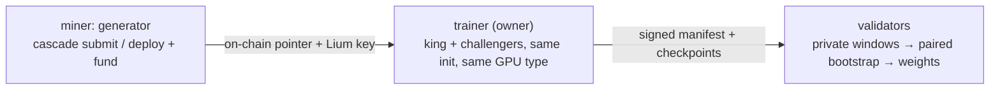

# sn91 - cascade (ᚁ)

snapshot_utc: 2026-09-24T17:34:39Z  |  block: 9139061  |  row_status: ok

## Chain row

- miner_burn: **0.0**
- registration cost: 0.1 TAO (29.262 USD), open=True
- tempo: 360.0  |  max_uids: 256  |  active: 13  |  free: 0
- subnet age: 209.1 days  |  registered at block 7633645
- weights_version: 0  |  mechanisms: 1

## Income (miner side)

- **competitive_miner_usd_day: 2513.0656487546053** (uid 87) <- the only figure quotable as achievable
- median_miner_usd_day: 628.2664121886513
- top_miner_usd_day: 2513.0656487546053 (uid 87, owner=False, validator_permitted=False) <- NOT achievable if owner or permitted

## Incentive structure (display only - never scored)

- earners: 5  |  gini: 0.46451612903225814  |  top1_share: 0.5161290322580645  |  top10_share: 1.0
- owner_incentive_share: 0.0 (independent check on miner_burn; disagreement 0.0)

## Repository

- on-chain URL: `https://github.com/TensorLink-AI/cascade`
- resolved URL: `https://github.com/TensorLink-AI/cascade`
- status: **ok** 
- README: 10618 bytes, sha f4b5be2b08018ea2
- latest release: worker-v0.12.0 2026-09-22T01:19:31Z
- last commit: 2026-09-24T12:58:45Z
- scoring-related commit: trainer: one GPU type per manifest — drop and requeue challengers on … 2026-09-20T07:38:07Z

## Resources

- min_compute.yml present: False  |  unmodified template: False
- required: cpu-only (~0 GB VRAM)  |  basis: **README keywords (GUESS)**
- cheapest satisfying machine: cpu-small at 0.9863 USD/day
- net margin: 627.2801 USD/day  |  payback on registration: 0.05 days

## Score

- gate: **OK** 
- score: 72.6 (rank 3), confidence 0.85 - hardware from README keywords, not curated
- components: income 25.45 / freshness 35.0 / resource 15.0 / registration 9.98
- freshness basis: RELEASE 2.7d ago

## On-chain description

> SOTA Time Series Foundation Models

## README excerpt (evidence for the brief)

```markdown
<p align="center">
  
</p>

# cascade: SOTA time-series foundation models on Bittensor

cascade builds time-series foundation models on Bittensor by competing on
**data**. The model is fixed and byte-identical for everyone; miners write the
synthetic data generators that train it. Better data trains a better
forecaster, and that is measured every round on private real-world windows.

- Miners: [docs/MINER.md](docs/MINER.md) (five-command version:
  [docs/MINER_FUNDED_QUICKSTART.md](docs/MINER_FUNDED_QUICKSTART.md))
- Validators: [docs/VALIDATOR.md](docs/VALIDATOR.md)
- Design: [docs/ARCHITECTURE.md](docs/ARCHITECTURE.md), decisions in `decisions/`

## Why compete on data

Recent time-series models win benchmarks through better synthetic priors, not
better architectures. Chronos-2 (Amazon) trains heavily on synthetic series and
its purely-synthetic ablation stays within a point of the full model on
GIFT-Eval ([arXiv 2510.15821](https://arxiv.org/abs/2510.15821)). FlowState
(IBM, 9.1M) out-forecasts rivals 20× its size after pretraining on CauKer
synthetic data ([arXiv 2508.05287](https://arxiv.org/abs/2508.05287)).
ForecastPFN and TempoPFN were trained on synthetic distributions only. DynaMix
beats Chronos zero-shot on real traffic and weather data with ~10k parameters
trained on 34 synthetic chaotic systems
([arXiv 2505.13192](https://arxiv.org/abs/2505.13192)). Toto 2.0 itself was
pretrained on 57.5% synthetic data.

The synthetic distribution does the heavy lifting. cascade makes that
distribution the competition.

## How it works

### The fixed model

A Toto2-4M backbone ([Datadog/Toto-2.0-4m](https://huggingface.co/Datadog/Toto-2.0-4m))
trained inside the subnet, never a fine-tune of released weights. Rounds
train from a shared init: random at generation 0, and since promotions
started firing, the promoted checkpoint of the previous generation (see
[the cascade](#the-cascade-promoted-generations)). Every learned parameter
was produced by the competition, so the corpus is the only source of signal.

Toto 2.0 is the first time-series family with a clean scaling law across
sizes (4M → 2.5B) under u-μP, so hyperparameters tuned at 4M transfer up the
ladder. The 4M rung trains from scratch in hours and sits on a curve known
to behave; the 22M rung is a built, dormant seam in `chain.toml`.

### A round

Rounds run every 12 h (`[round] epoch_blocks = 3600`, boundaries ≈ 08:30 and
20:30 UTC).

1. **Field.** Commitments revealed before the boundary, funded by their miner
   (the miner's own Lium key pays for the training pod), seat in reveal order
   up to the round's cap. Everyone seated duels the king; there is no heat
   screen. An unfunded boundary runs nothing.
2. **Training.** King and every challenger train the full budget (~5 h,
   enforced as a fixed token count) on the same GPU type, from the same init,
   with the same seeds. The only difference between runs is the generator.
3. **Manifest.** The operator signs a manifest of checkpoints and digests to
   Hippius S3 (mirrored to R2 and a HuggingFace dataset as fallbacks).
4. **Verdict.** Validators verify the manifest's signature and contract
   digests, score king and challengers on the same private windows
   (geomean of CRPS and MASE on a 64 / 256 / 720-step horizon ladder), and
   decide the throne with a paired bootstrap.
5. **Bench.** Each checkpoint is benched on GIFT-Eval / BOOM / TIME. These
   numbers are public telemetry and feed promotion, never the verdict.

**Rolling intake (next).** The boundary round gives way to rolling intake
(DEC-CA-0043): a funded leg trains the moment it is funded, every 3 h
boundary *settles* whatever finished against a king trained once per 12 h
era, and the GPU type is chosen per leg under price caps. The switch is
decided on chain rather than typed in (DEC-CA-0045): validators on the
release post a readiness note, and the first boundary where 51 % of
validator stake has signed locks in the switch for the boundary after it.
`docs/MINER.md` §6 has the miner view, `docs/VALIDATOR.md` the validator
side, `docs/MINER_FUNDED_ROUNDS.md` the operator sequence.



### The throne

A challenger takes the throne when the paired-bootstrap lower confidence
bound of its advantage clears the round's margin: 1% against a fresh king,
decaying to a 0.5% floor over 8 held rounds. With several challengers a
cohort-wide max-T correction keeps the king's false-dethrone risk fixed. From
block 9046800 the margin is priced against the per-round improvement over the
shared init, so a mature lineage stays dethronable.

Weights follow geometric decay across the lineage: the king plus up to 4
prior kings share ∝ `0.5**i` (≈ 52 / 26 / 13 / 6 / 3 %). Unregistered share
burns.

### Private code, public kings

Miners can submit code privately (`cascade submit`): it lives in the
operator's vault and trains on the miner's own pod. Only a king is published,
the moment it is crowned (`champion_publish = "crown"`), to `champions/` on
the manifest bucket; `cascade fetch king` resolves it. Losers stay private.

### Multivariate data

Generators may yield `(C, L)` series with up to 32 coupled channels. A channel
costs what it trains, step count is independent of width, and from block
9068400 multivariate eval windows are scored jointly.

## The cascade: promoted generations

When a king holds 5 consecutive rounds (`cascade_reign_rounds`), up to 3
(`cascade_top_k`) of the reign's best duel checkpoints, king's or
challengers', are promoted as the next warm-start generation. Members are
picked by the geometric mean of six signed benchmar
```

_(truncated at 6000 of 10618 chars - read the full file at https://github.com/TensorLink-AI/cascade)_
