# sn91 - cascade (ᚁ)

snapshot_utc: 2026-09-04T11:33:24Z  |  block: 8993731  |  row_status: ok

## Chain row

- miner_burn: **0.0**
- registration cost: 0.126494001 TAO (29.08982540997 USD), open=True
- tempo: 360.0  |  max_uids: 256  |  active: 12  |  free: 0
- subnet age: 188.9 days  |  registered at block 7633645
- weights_version: 0  |  mechanisms: 1

## Income (miner side)

- **competitive_miner_usd_day: 3370.8189744800407** (uid 23) <- the only figure quotable as achievable
- median_miner_usd_day: 842.7047436200102
- top_miner_usd_day: 3370.8189744800407 (uid 23, owner=False, validator_permitted=False) <- NOT achievable if owner or permitted

## Incentive structure (display only - never scored)

- earners: 5  |  gini: 0.46451612903225814  |  top1_share: 0.5161290322580645  |  top10_share: 1.0
- owner_incentive_share: 0.0 (independent check on miner_burn; disagreement 0.0)

## Repository

- on-chain URL: `https://github.com/TensorLink-AI/cascade`
- resolved URL: `https://github.com/TensorLink-AI/cascade`
- status: **ok** 
- README: 22622 bytes, sha 7935d1512c235e59
- latest release: worker-v0.7.0 2026-08-27T23:57:57Z
- last commit: 2026-09-03T06:29:18Z
- scoring-related commit: scoring: block-scheduled fresh-king margin (2% → 1% at 8992800), reso… 2026-09-03T02:30:30Z

## Resources

- min_compute.yml present: False  |  unmodified template: False
- required: unknown (~[UNKNOWN] GB VRAM)  |  basis: **no evidence**
- cheapest satisfying machine: rtx4090 at 8.2192 USD/day  <- ASSUMED default box; no hardware evidence was found, so the margin below is indicative only
- net margin: 834.4856 USD/day  |  payback on registration: 0.03 days

## Score

- gate: **OK** 
- score: 70.4 (rank 5), confidence 0.85 - hardware requirement unknown
- components: income 26.58 / freshness 35.0 / resource 11.25 / registration 9.99
- freshness basis: SCORING_COMMIT 1.2d ago

## On-chain description

> SOTA Time Series Foundation Models

## README excerpt (evidence for the brief)

```markdown
<p align="center">
  
</p>

# cascade: SOTA time-series foundation models on Bittensor

cascade is building state-of-the-art time-series foundation models (TSFMs) on
Bittensor. We start where the leverage is: **data**. In the first task, the
model is held byte-identical, so the only variable is data quality. Miners
compete by writing the data generators that feed the model — better synthetic
data means better forecasters. The full plan is in the
[technical roadmap](#technical-roadmap).

## Why compete on data

Synthetic data is not cascade's *only* lever, but we believe high-quality
synthetic data is critical for training a time-series foundation model. The
field points the same way: recent models keep winning benchmarks through
better synthetic priors, not better architectures.

- **Chronos-2** (Amazon, 120M) reaches state-of-the-art zero-shot accuracy on
  fev-bench, GIFT-Eval, and Chronos Benchmark II. It was trained heavily on
  *large-scale synthetic* series: Gaussian-process curves,
  trend/seasonality/irregularity mixtures, and random temporal causal graphs
  ([arXiv 2510.15821](https://arxiv.org/abs/2510.15821)). Their
  purely-synthetic ablation, Chronos-2-Synth, stays within about 1 skill point
  of the full model on GIFT-Eval (50.4 vs 51.4) and Chronos Benchmark II
  (46.4 vs 46.6). The authors note this suggests real data "may not even be
  required for effective pretraining."
- **FlowState** (IBM, 9.1M) is the smallest model in GIFT-Eval's top 10 and
  out-forecasts rivals more than 20x its size. It was pretrained in part on
  synthetic series from the CauKer generator
  ([arXiv 2508.05287](https://arxiv.org/abs/2508.05287)).
- **ForecastPFN** was trained purely on a synthetic distribution and was the
  first zero-shot forecaster to beat the then-SOTA with *no* real training
  data at all ([arXiv 2311.01933](https://arxiv.org/abs/2311.01933)).
  TempoPFN ([arXiv 2510.25502](https://arxiv.org/abs/2510.25502)) pushes the
  purely-synthetic recipe further.
- **DynaMix** (NeurIPS 2025) was trained on nothing but a narrow synthetic
  corpus of 34 chaotic dynamical systems. With about 0.1% of Chronos's
  parameters (~10k in total), it still beats Chronos zero-shot on real-world
  traffic and weather data it never saw — a small, well-curated synthetic
  prior beating a much larger real-data model
  ([arXiv 2505.13192](https://arxiv.org/abs/2505.13192)).

The pattern across the leaderboard: the synthetic data distribution does the
heavy lifting. cascade makes that distribution the competition itself. The
model is fixed; miners compete on the prior.

## How it works

### The fixed model

The fixed model is a Toto2-4M backbone
([Datadog/Toto-2.0-4m](https://huggingface.co/Datadog/Toto-2.0-4m),
arXiv 2605.20119), trained from the round's shared init. At generation 0 that
init is random; once the [cascade](#the-cascade-promoted-generations) has
promoted a generation (the live case today), rounds warm-start from the
promoted checkpoint instead. It is *never* a fine-tune of released weights.

This matters: every learned parameter is grown inside the subnet, so the
corpus is the only source of learned signal. The downstream forecast skill
measures the *data*, not what a pretrained checkpoint already knew. Even the
warm-start lineage was produced by the competition itself. Toto 2.0 itself was
pretrained on 57.5% synthetic data with zero public series and still tops
GIFT-Eval — cascade turns that synthetic-prior design into an open
competition.

```mermaid
flowchart TD
    subgraph miner["Miner (no GPU)"]
        gen["generator.py<br/>(DataGenerator)"]
        upload["push to Hippius Hub registry<br/>(OCI) → repo@digest"]
        commit["commit on-chain pointer<br/>metro-v1:gen:hippius:repo@digest"]
        gen --> upload --> commit
    end

    subgraph trainer["Trainer: owner-operated (the GPU boundary)"]
        resolve["resolve commitments before the<br/>12h epoch cutoff → king + field"]
        seeds["derive one shared RoundSeeds<br/>from epoch-boundary block hash<br/>(generation_seed + training_seed)"]
        heat["HEAT: train every challenger<br/>~1h (screen size) → screen<br/>→ top finalist"]
        trainK["FINAL: train king + finalist<br/>from the shared round init at every<br/>throne size (Toto2-4M live)"]
        upK["push ckpts → Hippius Hub registry<br/>logs/metrics → Hippius S3"]
        manifest["sign + publish TrainingManifest<br/>to Hippius S3 (size-tagged ckpt refs + digests)"]
        resolve --> seeds --> heat --> trainK --> upK --> manifest
    end

    subgraph validator["Validator (eval GPU)"]
        gate["verify signature +<br/>matching contract / base-arch digests<br/>(controlled-experiment gate)"]
        eval["pull king + finalist ckpts per size →<br/>score on shared held-out windows<br/>(CRPS/MWSQL + MASE)"]
        koth["paired-bootstrap LCB of<br/>geomean(CRPS, MASE) POOLED across sizes,<br/>finalist vs king → one KOTH verdict"]
        weights["geometric-decay weights<br/>(king + prior kings)"]
        gate --> eval --> koth --> weights
    end

    commit -->|on-chain| resolve
    manifest -->|S3 manifest + registry ckpts| gate

    classDef invariant fill:#fff3cd,stroke:#d39e00,color:#5c4400;
    class seeds,gate invariant;
```



> The highlighted boxes are where the controlled experiment lives: the trainer
> reuses one `RoundSeeds` for every run in the round, and the validator's
> digest gate rejects any manifest where king and challenger didn't share that
> contract. Details below.

### The round cadence

A round is one ~12h epoch (`[round] epoch_blocks`; it was 24h until
2026-07-28). The trainer runs exactly one round per epoch, so the king is
retrained twice a day. All trainings in a round share one `RoundSeeds` — the
same init, whether random or the promoted cascade warm-start.

Only generators whose on-chain pointer *revealed* strictly before the epoch
boundary compete in that roun
```

_(truncated at 6000 of 22622 chars - read the full file at https://github.com/TensorLink-AI/cascade)_
