# sn91 - cascade (ᚁ)

snapshot_utc: 2026-08-26T09:53:48Z  |  block: 8928438  |  row_status: ok

## Chain row

- miner_burn: **0.0**
- registration cost: 0.159838972 TAO (37.10022379092 USD), open=True
- tempo: 360.0  |  max_uids: 256  |  active: 12  |  free: 0
- subnet age: 179.8 days  |  registered at block 7633645
- weights_version: 0  |  mechanisms: 1

## Income (miner side)

- **competitive_miner_usd_day: 1453.2660798813301** (uid 81) <- the only figure quotable as achievable
- median_miner_usd_day: 726.6330399406651
- top_miner_usd_day: 2906.5321597626603 (uid 106, owner=False, validator_permitted=True) <- NOT achievable if owner or permitted

## Incentive structure (display only - never scored)

- earners: 5  |  gini: 0.4645161290322577  |  top1_share: 0.5161290322580645  |  top10_share: 1.0
- owner_incentive_share: 0.0 (independent check on miner_burn; disagreement 0.0)

## Repository

- on-chain URL: `https://github.com/TensorLink-AI/cascade`
- resolved URL: `https://github.com/TensorLink-AI/cascade`
- status: **ok** 
- README: 21692 bytes, sha 84f0e5e50b1aad9d
- latest release: pre-decay-wsd-contract 2026-08-15T11:02:58Z
- last commit: 2026-08-24T10:18:06Z
- scoring-related commit: (none) 

## Resources

- min_compute.yml present: False  |  unmodified template: False
- required: unknown (~[UNKNOWN] GB VRAM)  |  basis: **no evidence**
- cheapest satisfying machine: rtx4090 at 8.2192 USD/day  <- ASSUMED default box; no hardware evidence was found, so the margin below is indicative only
- net margin: 536.7556 USD/day  |  payback on registration: 0.07 days

## Score

- gate: **OK** 
- score: 68.9 (rank 10), confidence 0.85 - hardware requirement unknown
- components: income 24.84 / freshness 35.0 / resource 11.25 / registration 9.98
- freshness basis: SCORING_COMMIT 5.4d ago

## On-chain description

> SOTA Time Series Foundation Models

## README excerpt (evidence for the brief)

```markdown
# cascade: SOTA time-series foundation models on Bittensor

cascade is building state-of-the-art time-series foundation models (TSFM) on
Bittensor. We start where the leverage is: data. The first task holds the
model byte-identical so the only variable is data quality, and scores the data
generators that feed it — better synthetic data, better forecasters. The full
sequence is in the [technical roadmap](#technical-roadmap).

## Why compete on data

Synthetic data isn't cascade's *only* lever, but we believe high-quality
synthetic data is critical to training a time-series foundation model. That view
tracks the consensus direction of the field: recent models keep winning on
benchmarks by competing on synthetic priors, not architecture.

* Chronos-2 (Amazon, 120M) reaches state-of-the-art zero-shot accuracy on
  fev-bench, GIFT-Eval, and Chronos Benchmark II, trained heavily on
  *large-scale synthetic* series (Gaussian-process curves, trend/seasonality/
  irregularity mixtures, random temporal causal graphs)
  ([arXiv 2510.15821](https://arxiv.org/abs/2510.15821)). Their ablation
  trained *purely on synthetic data*, Chronos-2-Synth, stays within ~1 skill
  point of the full model on GIFT-Eval (50.4 vs 51.4) and Chronos Benchmark II
  (46.4 vs 46.6) — the authors note this suggests real data "may not even be
  required for effective pretraining."
* FlowState (IBM, 9.1M) is the smallest model in GIFT-Eval's top 10,
  out-forecasting rivals 20x+ its size, pretrained in part on synthetic series
  from the CauKer generator ([arXiv 2508.05287](https://arxiv.org/abs/2508.05287)).
* ForecastPFN is a prior-data fitted network trained purely on a synthetic
  distribution, and was the first zero-shot forecaster to beat the then-SOTA
  with *no* real training data at all
  ([arXiv 2311.01933](https://arxiv.org/abs/2311.01933)); TempoPFN
  ([arXiv 2510.25502](https://arxiv.org/abs/2510.25502)) carries the
  purely-synthetic pretraining recipe further.
* DynaMix (NeurIPS 2025) is trained on nothing but a narrow synthetic corpus
  of 34 chaotic dynamical systems and, with ~0.1% of Chronos's parameters
  (~10k in total), still beats Chronos zero-shot on real-world traffic and
  weather it never saw: a small, well-curated synthetic prior outperforming a far
  larger real-data model ([arXiv 2505.13192](https://arxiv.org/abs/2505.13192)).

The throughline: across the leaderboard, the synthetic data distribution is doing
the heavy lifting. cascade turns that distribution into the competitive surface,
holding the model fixed so miners compete the prior.

## How it works

The fixed process is a Toto2-4M backbone trained from random initialisation
([Datadog/Toto-2.0-4m](https://huggingface.co/Datadog/Toto-2.0-4m), arXiv
2605.20119), *not* a fine-tune of released weights. Training from scratch is the
point: the corpus is then the only source of learned signal, so the downstream
forecast skill measures the *data*, not what some pretrained checkpoint already
knew. (Once the [cascade](#the-cascade-promoted-generations) promotes a
generation, rounds warm-start from the promoted checkpoint instead — a lineage
the competition itself produced, still never anyone's released weights.)
Toto 2.0 itself is 57.5% synthetic data with zero public series in pretraining and still tops GIFT-Eval, and cascade turns that synthetic-prior
design into an open competition.



```mermaid
flowchart TD
    subgraph miner["Miner (no GPU)"]
        gen["generator.py<br/>(DataGenerator)"]
        upload["push to Hippius Hub registry<br/>(OCI) → repo@digest"]
        commit["commit on-chain pointer<br/>metro-v1:gen:hippius:repo@digest"]
        gen --> upload --> commit
    end

    subgraph trainer["Trainer: owner-operated (the GPU boundary)"]
        resolve["resolve commitments before the<br/>12h epoch cutoff → king + field"]
        seeds["derive one shared RoundSeeds<br/>from epoch-boundary block hash<br/>(generation_seed + training_seed)"]
        heat["HEAT: train every challenger<br/>~1h (screen size) → screen<br/>→ top finalist"]
        trainK["FINAL: train king + finalist<br/>from the shared round init at every<br/>throne size (Toto2-4M live)"]
        upK["push ckpts → Hippius Hub registry<br/>logs/metrics → Hippius S3"]
        manifest["sign + publish TrainingManifest<br/>to Hippius S3 (size-tagged ckpt refs + digests)"]
        resolve --> seeds --> heat --> trainK --> upK --> manifest
    end

    subgraph validator["Validator (eval GPU)"]
        gate["verify signature +<br/>matching contract / base-arch digests<br/>(controlled-experiment gate)"]
        eval["pull king + finalist ckpts per size →<br/>score on shared held-out windows<br/>(CRPS/MWSQL + MASE)"]
        koth["paired-bootstrap LCB of<br/>geomean(CRPS, MASE) POOLED across sizes,<br/>finalist vs king → one KOTH verdict"]
        weights["geometric-decay weights<br/>(king + prior kings)"]
        gate --> eval --> koth --> weights
    end

    commit -->|on-chain| resolve
    manifest -->|S3 manifest + registry ckpts| gate

    classDef invariant fill:#fff3cd,stroke:#d39e00,color:#5c4400;
    class seeds,gate invariant;
```

> The highlighted boxes are where the controlled experiment lives: the trainer
> reuses one `RoundSeeds` for every run in the round, and the validator's digest gate
> rejects any manifest where king and challenger didn't share that contract. Details below.

**The round cadence.** A round is one ~12h epoch (`[round] epoch_blocks`; it was
24h until 2026-07-28): the trainer runs exactly one round per epoch, so the king
is retrained twice a day and each round's trainings share one `RoundSeeds`
(identical random init). Only
generators whose on-chain pointer *revealed* strictly before the epoch boundary
compete in that round — deploy defaults to a timed reveal targeting just before
the boundary (docs/MINER.md §5a), and a reveal that lands late rolls into the
next one. Each round has two stages: a cheap
**heat** trains every eligible challenger for `[ro
```

_(truncated at 6000 of 21692 chars - read the full file at https://github.com/TensorLink-AI/cascade)_
